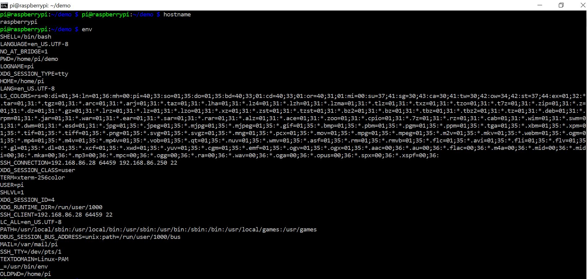
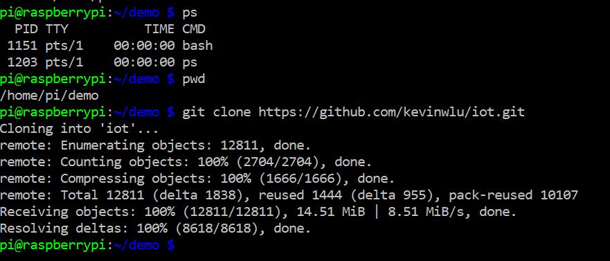
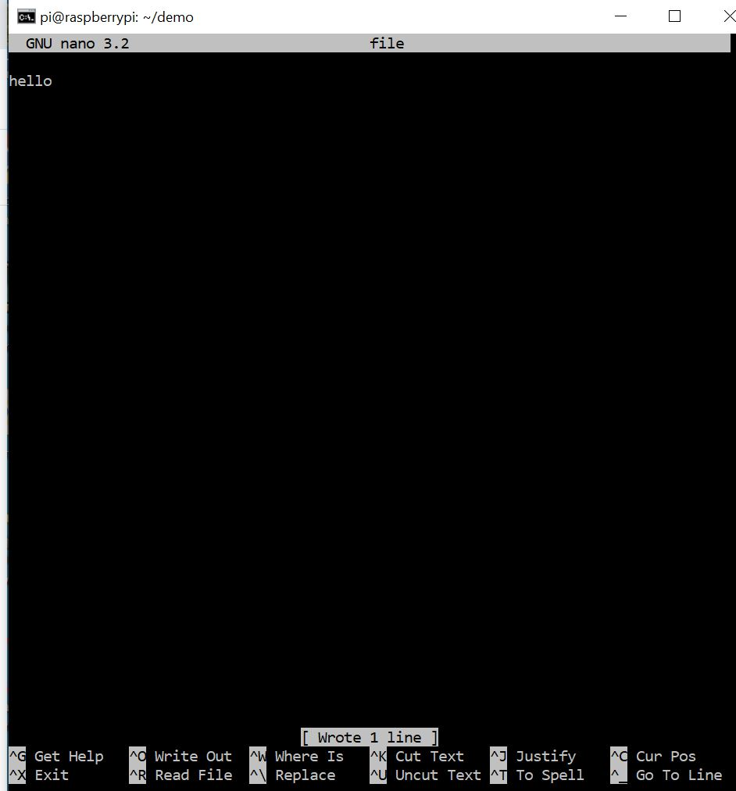
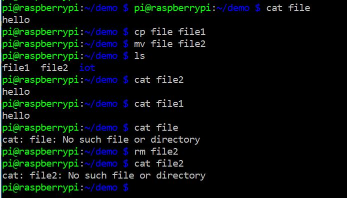
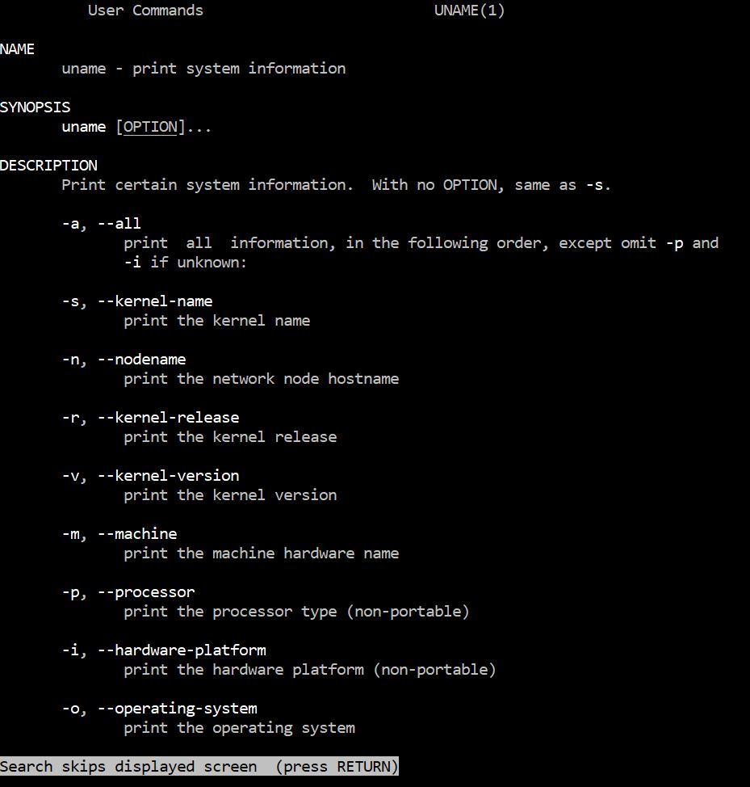
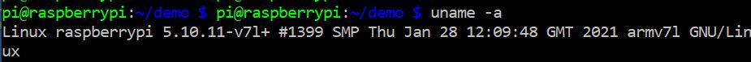
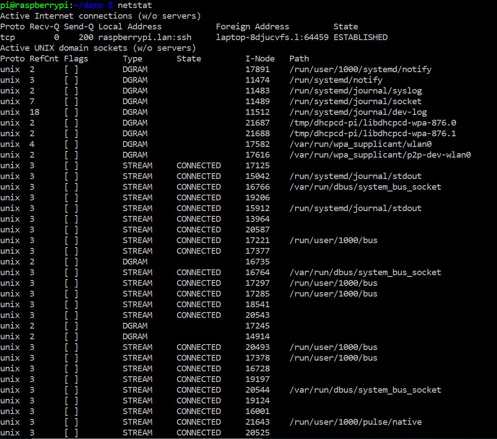

# Labs 1/2 Documentation

## In this lab, basic commands were run in the terminal of the raspberry pi
## All work was done on a pc through an ssh connection to the pi.

# hostname and env

# ps, pwd and clone

# cd, ls and df

# nano

# cat, cp, mv and rm

# man uname

# uname -a

# ifconfig and ping localhost

# netstat

