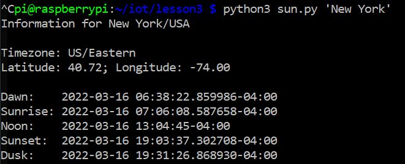
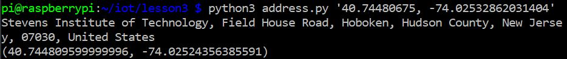

# Labs 3 Documentation

## In this lab, python programs were run in the terminal of the raspberry pi
## All work was done on a pc through an ssh connection to the pi.

# julian.py

# date_example.py

# datetime_example.py

# time_example.py

# sun.py

# moon.py

# coordinates.py

# address.py

# cpu.py

# battery.py

# documentstats.py
